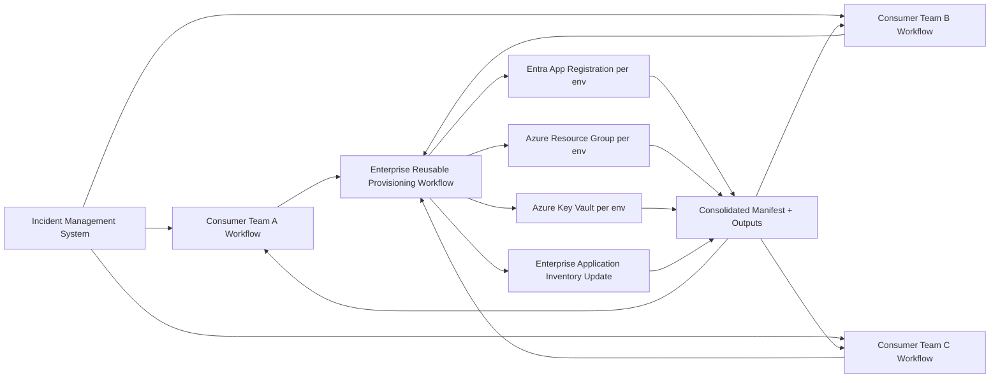

# New Azure App Provision POC

This repository provides an enterprise reusable GitHub Actions workflow that can be called by project teams to provision Azure application resources across `dev`, `test`, and `prod`.

## What this POC provisions

For each environment:
- An Entra app registration
- A dedicated Azure resource group
- A Key Vault in the environment resource group
- Environment-specific manifest data and resource tags

The workflow also creates:
- A consolidated manifest output for all environments
- An updated enterprise inventory snapshot containing the newly requested application

## Repository structure

```text
.
├── .github/workflows/
│   ├── enterprise-provision-azure-app.yml
│   └── sample-consumer-incident-request.yml
├── docs/
│   ├── architecture-diagram.md
│   └── prompts.txt
├── inventory/
│   └── applications.json
├── samples/
│   └── incident-request-devtestprod.json
├── LICENSE
└── README.md
```

## Enterprise reusable workflow

Workflow: `.github/workflows/enterprise-provision-azure-app.yml`

The workflow is designed for `workflow_call` and accepts business + technical metadata:
- application name and business objective
- application tier
- cost center
- technical owner / business owner
- region
- severity and confidentiality
- platform and business unit

It outputs:
- `resource_groups` (JSON)
- `app_registrations` (JSON)
- `consolidated_manifest` (JSON)
- `inventory_entry` (JSON)

If Azure credentials are passed, it performs provisioning with Azure CLI.  
If not, it runs in simulation mode and still returns the manifest/inventory artifacts.

## Sample consumer workflow (incident-driven request)

Workflow: `.github/workflows/sample-consumer-incident-request.yml`

This sample simulates a project team request coming from incident management via `workflow_dispatch`, then calls the enterprise workflow and returns:
- resource groups per environment
- app registrations per environment
- consolidated manifest in workflow summary

## Architecture diagram

The architecture source is stored at `docs/architecture-diagram.md`.


