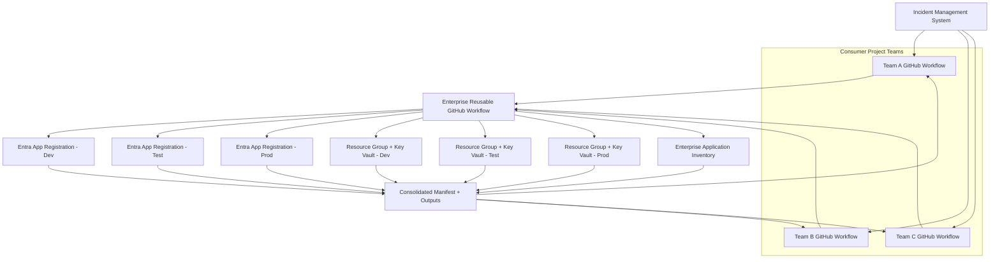

# Enterprise Azure App Provisioning Architecture

```mermaid
flowchart TB
  subgraph Consumers[Consumer Project Teams]
    TeamA[Team A GitHub Workflow]
    TeamB[Team B GitHub Workflow]
    TeamC[Team C GitHub Workflow]
  end

  IMS[Incident Management System] --> TeamA
  IMS --> TeamB
  IMS --> TeamC

  TeamA --> EPW[Enterprise Reusable GitHub Workflow]
  TeamB --> EPW
  TeamC --> EPW

  EPW --> APPDEV[Entra App Registration - Dev]
  EPW --> APPTEST[Entra App Registration - Test]
  EPW --> APPPROD[Entra App Registration - Prod]
  EPW --> RGDEV[Resource Group + Key Vault - Dev]
  EPW --> RGTEST[Resource Group + Key Vault - Test]
  EPW --> RGPROD[Resource Group + Key Vault - Prod]
  EPW --> INV[Enterprise Application Inventory]

  APPDEV --> RESP[Consolidated Manifest + Outputs]
  APPTEST --> RESP
  APPPROD --> RESP
  RGDEV --> RESP
  RGTEST --> RESP
  RGPROD --> RESP
  INV --> RESP

  RESP --> TeamA
  RESP --> TeamB
  RESP --> TeamC
```
